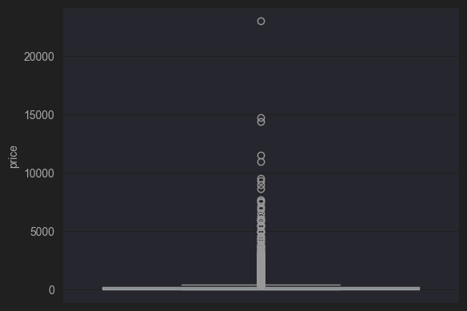
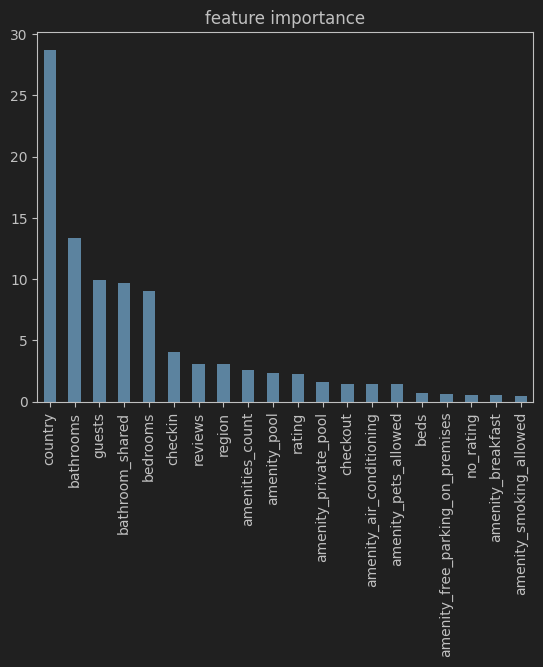

# Airbnb price prediction

A web app that predicts the nightly price of an Airbnb listing from its
characteristics (country, region, number of rooms/bathrooms, rating,
amenities, etc.). It's made of two services: a **FastAPI** backend serving a
CatBoost model, and a **Streamlit** frontend with the input form.

## Project structure

```
.
├── api.py                  # FastAPI backend: /predict, /amenities
├── app/
│   └── main.py               # Streamlit frontend
├── common/
│   └── constants.py          # shared constants (top-N categories, amenity list)
├── models/
│   └── cbr.jbl                # trained CatBoostRegressor
├── datasets/
│   └── airbnb_updated.csv    # cleaned dataset (used by the UI and to compute top-N)
├── Airbnb.ipynb              # notebook with EDA, preprocessing and model training
├── Dockerfile.api
├── Dockerfile.streamlit
├── compose.yaml
├── requirements.txt
├── .gitignore
└── .dockerignore
```

`api.py` and `app/main.py` are two independent processes that talk over HTTP
(`app/main.py` calls `POST /predict`), so they can be deployed and scaled
separately. `common/constants.py` is a shared module so the backend and
frontend never disagree about which categories/amenities the model actually
understands.

## The dataset

The raw [data](https://www.kaggle.com/datasets/ashishjangra27/airbnb-dataset) (`datasets/airbnb.csv`) is a
worldwide export of Airbnb listings: **12,805 listings**, ~30 raw columns
(id, title, host, address, amenities as free text, house rules, photo links,
etc.). The preprocessing in `Airbnb.ipynb` ("Data preparation") turns this
into 46 model features:

1. **`amenities`** (free text) → a list of amenities → `amenities_count`
   (total count) + 30 binary `amenity_*` columns for the most common ones.
2. **`address`** → `country` + `region` (the second-to-last address part).
3. **`features`** (text like "2 bedrooms · 1 bathroom · Shared") →
   `bathrooms`, `bedrooms`, `beds`, `guests`, `toiles`, `studios`,
   `bathroom_shared` / `bathroom_private` / `toilet_only`.
4. Missing `checkin`/`checkout` — filled with the mode; missing `rating` —
   filled with the training-set median plus a separate `no_rating` flag (so
   the model knows the rating was missing instead of treating it as an
   actual average).
5. Columns irrelevant to price were dropped: `features`, `id`, `name`,
   `host_name`, `host_id`, `safety_rules`, `hourse_rules`, `img_links`, the
   stray `Unnamed: 0`.
6. **`price`** was converted to a single currency (`price / 83` — going by
   the ratio, the original prices look like Indian rupees) and log-transformed
   (`log1p`), because the price distribution is heavily right-skewed (a small
   number of very expensive listings). The model predicts `log1p(price)`, and
   the API returns `expm1(prediction)` — i.e. a plain, "human" price per
   night.
### Boxplot


`datasets/airbnb_updated.csv` is the dataset at exactly this stage (already
cleaned, but **before** top-N category bucketing and **before** the
train/test split).

## Why only the top 20 countries and top 30 regions

This is a key nuance underlying the strange behavior of the forecasting mechanism - which I later had to debug.

`country` and `region` are categorical features with huge, very uneven
cardinality:

| Feature | Unique values | Share of listings covered by top-N |
|---|---|---|
| `country` | 119 | top 20 countries = **80.1%** of all listings |
| `region`  | 2185 | top 30 regions = **39.2%** of all listings |

The median country appears only **18 times** in the whole dataset, and
**13 countries have exactly one listing**. Regions are worse: **1,258 of
2,185 regions (58%) appear exactly once**. Using every single value as its
own category is a bad idea for three reasons:

- **One-hot encoding blows up in dimensionality.** For models without native
  categorical support (RandomForest/XGBoost/LightGBM in the notebook),
  `pd.get_dummies` over every country/region would add hundreds of extra,
  mostly-empty columns with barely any signal (LightGBM ended up training on
  103 columns instead of CatBoost's 46).
- **Statistics on rare categories are unreliable.** If a country appears once,
  the model essentially just memorizes that one listing's price as the
  "country effect" — that's noise, not signal, and it drives overfitting.
- **Inference will always run into values that were never seen during
  training.** A user filling out the form can pick a country that never
  appeared in the dataset at all - the model needs to handle that
  predictably.

The fix (notebook, cell 35, `bucket_top_n`) is to compute the top-N **using
only the training split** (`test_size=0.3, random_state=42`, to avoid peeking
at the test set) and **replace everything else with the literal string
`"Other"`** before training even starts:

```python
TOP_N = {"region": 30, "country": 20, "checkin": 5, "checkout": 5}

def bucket_top_n(train_col, test_col, n):
    top = train_col.value_counts().nlargest(n).index
    return train_col.where(train_col.isin(top), "Other"), \
           test_col.where(test_col.isin(top), "Other")
```

CatBoost sees the `"Other"` category thousands of times and learns a
meaningful, averaged statistic for it - unlike for any single rare country.

**An important detail we initially missed in the API implementation:** if you
simply pass the model a "raw" string at inference time (e.g. the real name of
a country that wasn't in the top 20), CatBoost treats it as a *category it
has never seen* — which is not the same thing as the trained `"Other"`
category. In practice this produced the same, but *incorrect*, prediction for
any two different "rare" countries (the model was just falling back to an
internal default). That's why `common/constants.py` hardcodes the exact
`TOP_COUNTRIES` / `TOP_REGIONS_BY_COUNTRY` / `TOP_CHECKIN` / `TOP_CHECKOUT`
lists (reproduced with the same `train_test_split`), and `api.py` explicitly
runs `country`/`region`/`checkin`/`checkout` through `bucket_country()` /
`bucket_region()` / `bucket_checkin()` / `bucket_checkout()` before predicting
— i.e. it replays the exact same logic used during training. The frontend
(`app/main.py`) only offers the values that actually change the prediction
for those same fields (plus `"Other"`), so it doesn't create the illusion of
choice where, as far as the model is concerned, everything behaves
identically anyway.

## The model

The notebook compares four models (metrics below are R² on the real price,
i.e. after `expm1`, not on the log scale):

| Model | Category encoding | R² train | R² test | train − test |
|---|---|---|---|---|
| **CatBoost** *(used in production)* | native (`cat_features`) | 0.638 | 0.585 | **0.053** |
| RandomForest | One-Hot | 0.839 | 0.601 | 0.238 |
| XGBoost | One-Hot | 0.753 | 0.630 | 0.123 |
| LightGBM | One-Hot | 0.718 | 0.623 | 0.095 |

*(R² here is computed on the `log1p` price scale — the same scale the models
were trained on.)*

CatBoost isn't the top model by raw test R² — but it has by far the smallest
gap between train and test (0.05 vs. 0.10–0.24), meaning the least
overfitting, plus it doesn't need a bloated one-hot column set and handles
categoricals natively (which is exactly what drove the whole `"Other"`-
bucketing approach above). It was trained as:

```python
CatBoostRegressor(
    n_estimators=1000, learning_rate=0.01, depth=6, l2_leaf_reg=10,
    loss_function="RMSE", eval_metric="MAPE",
    bootstrap_type="Bayesian", random_strength=1, bagging_temperature=1,
    rsm=0.8, random_state=42, early_stopping_rounds=100,
)
```

**Feature importance:** `country` dominates (~29%), followed by `bathrooms`,
`guests`, `bathroom_shared`, `bedrooms` — together these account for more
than half of the model's total importance. Out of the 30 binary
`amenity_*` columns, only 7 actually move the price in a meaningful way
(Pool, Private pool, Air conditioning, Pets allowed, Breakfast, Free parking
on premises, Smoking allowed) — the rest (Wifi, Kitchen, TV, washing machine,
etc.) have 5–10x lower importance because almost every listing has them and
they carry little signal. That's why the form only shows those 7 amenities
(see `common/constants.py`) instead of all 30 the model learned about.


## Running it

### Docker (recommended)

```bash
docker compose up --build
```

- FastAPI: http://localhost:8000 (docs at http://localhost:8000/docs)
- Streamlit: http://localhost:8501

`compose.yaml` brings up both services; `streamlit` explicitly `depends_on`
`api`, but actually waiting for the API to be ready is handled by
`app/main.py` itself (if the API is unreachable, the form shows a clear error
telling you to start the backend).

### Locally, without Docker

```bash
pip install -r requirements.txt

# terminal 1 — backend
PYTHONPATH=. uvicorn api:app --reload

# terminal 2 — frontend
PYTHONPATH=. streamlit run app/main.py
```

`PYTHONPATH=.` is needed so `common/constants.py` resolves as
`common.constants` from the project root — the same way it's set up via
`ENV PYTHONPATH=/code` in both Dockerfiles.

## API

**`GET /`** — health check, `{"status": "ok"}`.

**`GET /amenities`** — the list of amenities the model understands (the same
7 shown in the form) — so the frontend doesn't have to hardcode the list
separately.

**`POST /predict`**

```json
{
  "country": "Turkey",
  "region": "Antalya",
  "bathroom_type": "Private",
  "bathrooms": 1,
  "beds": 2,
  "guests": 4,
  "bedrooms": 2,
  "toiles": 0,
  "studio": false,
  "checkin": "Flexible",
  "checkout": "Unknown",
  "rating": 4.8,
  "reviews": 50,
  "amenities": ["Pool", "Air conditioning"]
}
```

→

```json
{"prediction": 101.78}
```

`rating: null` means the listing has no rating yet; the backend then fills in
the training-set median rating and sets the `no_rating` flag, matching how
training was set up. `country`/`region`/`checkin`/`checkout` can be any
string — the backend will bucket it to `"Other"` itself if it's not one of
the categories the model actually learned.

## Tests

The test suite lives in `tests/` and covers all three layers of the project:
the shared bucketing logic, the FastAPI backend, and the Streamlit frontend.

```
tests/
├── conftest.py          # puts the project root on sys.path so `common`,
│                         # `api`, and `app` resolve regardless of cwd
├── test_constants.py    # unit tests for common/constants.py
├── test_api.py          # FastAPI endpoint tests (TestClient, no server needed)
└── test_streamlit.py    # Streamlit UI tests (AppTest, no browser needed)
```

### What's covered

- **`test_constants.py`** — the amenity list (uniqueness, `amenity_*` column
  prefixes), the top-N list sizes, and the `bucket_country` /
  `bucket_region` / `bucket_checkin` / `bucket_checkout` helpers, including
  the case where a region valid for one country must fall back to `"Other"`
  for a different country.
- **`test_api.py`** — health/metadata endpoints, the happy path for
  `/predict`, pydantic validation (negative numbers, out-of-range ratings,
  invalid enums, missing/wrong-typed fields), the `"Other"`-bucketing
  regression tests (two different unseen countries must produce the exact
  same prediction, not just "some" fallback), and the amenity handling
  (e.g. `Pool` should measurably raise the predicted price).
- **`test_streamlit.py`** — the form loads without exceptions, all expected
  widgets are present, every numeric input has `min_value`/`max_value` set
  (so the +/- steppers can't be abused to push a value out of range before
  validation kicks in), country/region captions reflect what the model can
  actually distinguish, and a full end-to-end run of clicking "Predict"
  (with the FastAPI app mounted in-process via `monkeypatch`, so no real
  network call or separate `uvicorn` process is needed) — including the
  case where the API is unreachable.

### Running the tests

```bash
pip install -r requirements.txt -r requirements-dev.txt

PYTHONPATH=. pytest
```

`pytest.ini` sets `testpaths = tests`, so plain `pytest` from the project
root is enough. `PYTHONPATH=.` (or running from the project root, which
`conftest.py` also forces via `sys.path`) is needed for the same reason it's
needed to run the app itself - so `common.constants` resolves. Both
`api.py`'s CatBoost model load and `app/main.py`'s dataset read use paths
relative to the project root, so tests must run from there.

`requirements-dev.txt` adds `pytest` and `httpx` (needed by FastAPI's
`TestClient`) on top of `requirements.txt`; `streamlit`'s `AppTest` module is
already part of the `streamlit` package pulled in by `requirements.txt`.

## Limitations

- The model was trained on a snapshot of the market at the time the dataset
  was collected — seasonality, inflation, and price changes in specific
  destinations since then aren't accounted for.
- The currency conversion (`/ 83`) is a hardcoded constant from when the data
  was collected, not a live exchange rate.
- For countries/regions outside the top 20/top 30, predictions fall back to
  the averaged `"Other"` category — this is less precise than for popular
  destinations, since it doesn't capture anything specific to that
  particular rare location.